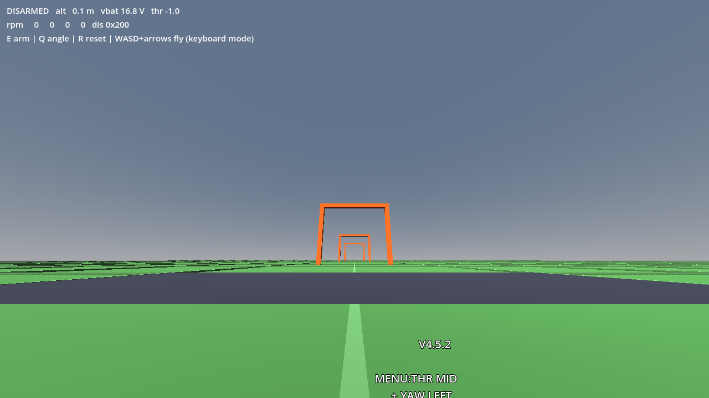
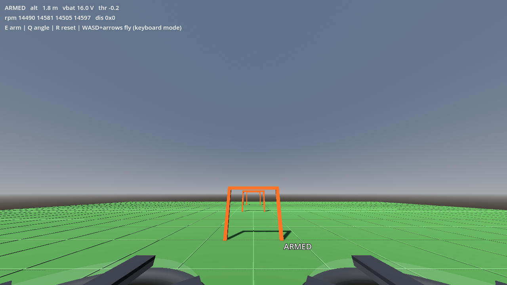

# propwash

**An open-source FPV drone simulator that runs *real Betaflight firmware* in the loop.**

Unlike commercial sims (VelociDrone, Liftoff), propwash doesn't approximate the
flight controller — it compiles the pilot's actual Betaflight firmware (pinned
**4.5.2**) into the simulator process and runs the real scheduler, PID loops,
rates, arming logic, failsafe, and OSD against a physics model. Load your literal
`diff all` off the quad and the sim flies with **your** tune.

Built around a GEPRC **CineLog35 V3** (3.5″ ducted cinewhoop, F722), but the
pairing is generic to any serial-ELRS + Betaflight setup.




*FPV view from where the DJI O3 sits — front ducts and props in frame, the real
Betaflight OSD overlaid, live motor RPM in the HUD.*

## Why

Every other sim reimplements or approximates the flight controller. propwash
runs the genuine article, which makes it uniquely suited to four things a
normal sim can't do:

1. **Train on your exact tune** — same PIDs, rates, filters, arming/failsafe
   behaviour as the real quad — including DSHOT600, crashflip (turtle mode)
   and the RPM filter running on bidirectional-DSHOT eRPM that the virtual
   ESC derives from the physics' true motor speeds.
2. **Deterministic lockstep** — identical inputs produce byte-identical
   trajectories, across runs, processes and resets, and the test suite gates
   it ([Determinism](#determinism)). That's what backs a reproducible RL gym
   and blackbox replay for sim-vs-real validation.
3. **Configurator-compatible** — the real Betaflight Configurator connects over
   TCP and tunes it live, exactly like a bench quad. `PROPWASH_DEMO=retune`
   does it end to end: fly a roll, land, change `roll_srate` over the CLI,
   save, fly the identical stick input again — and the quad rolls 1.5× faster.
4. **Crashes are real** — contacts are resolved as forces inside the physics
   tick, so the firmware *feels* impacts on its virtual gyro/accel exactly like
   real hardware (its own crash detection works, straight from your dump).
   Gates and trees are solid, impact speed maps to per-motor prop damage, a
   hard crash grounds you because damaged props can't lift the quad — and you
   fix it (`T`) or walk back to the pad (`R`), not respawn through a menu.

## Architecture

```
┌─────────────────────────────────────────────────────────────┐
│ propwash-core   (C++, GPL-3.0, standalone executable)       │
│  ┌───────────────┐   in-process    ┌─────────────────────┐  │
│  │ physics 20kHz │ ── gyro/accel ► │ Betaflight 4.5.2    │  │
│  │ (rigid body,  │ ◄─ motor PWM ── │ (static lib: real   │  │
│  │  motors, bat, │                 │  scheduler + PIDs)  │  │
│  │  contacts,    │                 └──────────┬──────────┘  │
│  │  damage, wind)│                            │ TCP 5761    │
│  └──────┬────────┘                            │             │
│         │  UDP protocol (versioned):          │             │
│         │  pose + contact manifold in,        │             │
└─────────┼  state + damage out ─────────────── ┼────────────┘
          │                                     │
   Godot 4 client / Quest 3 (planned) /   Betaflight Configurator
   Python gym / blackbox replay + sysid        (MSP / CLI)
```

- **In-process, not networked SITL.** The core links Betaflight's C internals
  directly (the [SimITL](https://github.com/AJ92/SimITL) approach) and drives
  its scheduler tick-by-tick, so simulated time only advances with sim steps.
  That determinism is the whole point; stock Betaflight SITL free-runs on wall
  clock and can't give reproducible rollouts.
- **Process boundary = license boundary.** The core is GPL-3.0 (it contains
  Betaflight); every client speaks a documented UDP protocol (`protocol/`, MIT)
  and carries no GPL code.
- **The tick rate (20 kHz) exceeds the gyro/PID rate (8 kHz)** on purpose — the
  scheduler only services non-realtime tasks (RX, MSP) between gyro boundaries.
- **The client senses collisions, the core solves them.** The client owns world
  geometry and position: it tests a shared 5-sphere hull against the world each
  frame and sends the contact manifold (point, normal, depth, surface). The
  core resolves contacts as spring-damper *forces* inside the physics tick —
  never velocity edits, which the virtual accelerometer cannot see — so
  touchdown, ground rest and crashes reach the firmware the way real sensors
  would. Impact speed then drives a deterministic damage model (prop damage,
  prop strikes, structural crashes), and wind is a pure function of sim time +
  seed, so reproducibility survives all of it.

See [`docs/ARCHITECTURE.md`](docs/ARCHITECTURE.md) for the details, including the
two lockstep scheduler patches and the OSD/CLI plumbing.

## Layout

| Path | License | What |
|------|---------|------|
| `core/` | GPL-3.0 | propwash-core: sim loop, physics, Betaflight glue, UDP server, joystick |
| `extern/betaflight/` | GPL-3.0 | Betaflight submodule, pinned @ tag `4.5.2` |
| `extern/betaflightext/` | GPL-3.0 | Override layer (SITL-derived target, patched scheduler/cli, fake OSD displayport) + recorded diffs in `patches/` |
| `protocol/` | MIT | Wire protocol — single header, no Betaflight includes (the boundary) |
| `client-godot/` | MIT | Godot 4 frontend: FPV cinewhoop, OSD overlay, joystick/keyboard |
| `python/propwash_gym/` | MIT | Gymnasium env (RL): `uv`-managed, subprocess-per-env, `frame_id` lockstep |
| `tools/tester/` | GPL-3.0 | Headless tests: boot/MSP identity, hover, determinism, OSD, real-tune |
| `tools/sysid/` | GPL-3.0 | Blackbox replay + system ID: fit the physics to a real log (RC & physics-only replay) |
| `tools/bfcli/` | MIT-ish | CLI-over-TCP: apply the pilot's `diff all`, bake eeprom, calibrate joystick |
| `config/` | — | The real `cinelog35v3.diff` + SITL overrides |
| `docs/` | — | Architecture, licensing, screenshots |

## Build

No external dependencies — just a C/C++ toolchain and CMake.

```bash
git clone --recursive https://github.com/<you>/propwash
cd propwash
cmake -B build -DCMAKE_BUILD_TYPE=RelWithDebInfo
cmake --build build -j
ctest --test-dir build            # self-tests: boot, hover, crashes, determinism, OSD, real-tune
```

Requires CMake ≥ 3.20 and GCC ≥ 12 or Clang. (Builds clean on GCC 16; the
pinned Betaflight needs a couple of `-Wno-error` for newer GCC, already handled
in `extern/CMakeLists.txt`.)

If you cloned without `--recursive`: `git submodule update --init --recursive`.

### Platforms

CI builds and tests every push on all three ([`ci.yml`](.github/workflows/ci.yml)):

| platform | status |
|---|---|
| Linux (x86_64) | primary — full test suite, joystick support |
| macOS (arm64) | full test suite (AppleClang; `-dead_strip` replaces the GNU linker script) |
| Windows (MinGW-w64) | full headless test suite under MSYS2/Ninja |

Your radio works on all three, by different paths: on Linux the core reads
the handset directly (kernel `js` API, no SDL2); on macOS/Windows the Godot
client reads it through Godot's cross-platform input and injects RC over the
wire — the core's RC priority falls through when it has no local joystick.
Only the core-side `--js-calibrate` wizard is Linux-specific. The Godot
client runs in CI on Linux and macOS (pinned Godot 4.7.1).

## Fly it

Install Godot 4.7+ (`pacman -S godot`, `apt install godot`, or grab the
[official binary](https://godotengine.org/download)), then:

```bash
# one-time: bake your tune into an eeprom the client will use
tools/bfcli/load_config.sh                 # writes ./eeprom.bin

PROPWASH_EEPROM=$PWD/eeprom.bin godot --path client-godot
```

The Godot client spawns `build/propwash-core` itself.

### Controls

- **RadioMaster Pocket / any EdgeTX handset** in USB Joystick mode —
  auto-detected by name. On Linux the core reads it directly (calibrate once:
  `./build/propwash-core --js-calibrate`); on macOS/Windows the Godot client
  reads it and injects RC over the wire.
- **No radio** — keyboard: arrows = right stick, `W`/`S` throttle, `A`/`D` yaw,
  `E` arm, `Q` angle toggle, `F` turtle switch, `T` repair in place, `R` reset
  to pad.
- **Won't arm?** The core prints a `[pw][rc]` log line with the 8 RC channels
  and a decoded arming-block reason on every change — read that before touching
  the switch mapping.

### Crashes, damage and turtle mode

Gates, trees and the ground are solid; hitting them costs momentum and props.
The HUD shows per-motor damage, a hard impact puts up a `CRASHED` banner, and a
wrecked quad genuinely cannot hover (the thrust isn't there any more). Disarm
and press `T` to repair + set the quad upright where it lies, or `R` to reset
to the pad. `PROPWASH_STRICT=1` disables `T` for deliberate practice — a crash
then always ends the flight. If your dump sets `crash_recovery = DISARM`, the
firmware's own crash detection disarms you exactly as on hardware
(`CRASH DETECTED` banner; cycle the ARM switch to clear). And when you end up
upside-down: disarm, flip the turtle switch (`F`), arm, and roll — the props
reverse over real DSHOT spin-direction commands and the quad pivots itself
upright over a duct edge, exactly the crashflip maneuver from the real quad.

### Demo mode

```bash
PROPWASH_DEMO=reel PROPWASH_SCENE=park PROPWASH_QUALITY=high \
  PROPWASH_EEPROM=$PWD/eeprom.bin godot --path client-godot
```

The demo flies in **real ACRO** — self-levelling off, so the sticks command
rates and the firmware's own rate curve and PID loop are genuinely in the path.
A cascaded controller (`client-godot/scripts/demo_pilot.gd`) closes position,
velocity, attitude and rate loops itself. It deliberately does **not** model
your rate curve: reading it would mean talking MSP mid-run, which forfeits
determinism, so the inner loop closes on rate *error* and works against any
tune.

| chapter | what it shows |
|---|---|
| `reel` | `freestyle` → `turtle` → `ghost` as one continuous take — the capture chapter |
| `freestyle` | 22 maneuvers in the park: gates, backflip, loop gate, slalom, roll, a 15 m dive off the scaffold tower, an orbit, a split-S, a yaw spin |
| `turtle` | crash inverted, flip back over on reversed props, fly away |
| `ghost` | record a stick tape, reset, replay it against a translucent ghost of the previous run — then change one stick sample by a microsecond |
| `retune` | fly a roll, land, change `roll_srate` over the real CLI, save, fly the same input again — peak roll rate goes 683 → 1031 deg/s |
| `gateline` | the three race gates in ACRO (the minimal controller regression) |
| `probe` | prints what each stick actually does; how the sign table was measured |
| `move:<kind>` | one maneuver in isolation — `flip`, `roll`, `split_s`, `dive`, `orbit`, `yaw_spin`, `hover` |
| `loop` | `reel` on repeat for a stand; move a stick on a connected handset to take over, and it hands back after 6 s of quiet |
| `acro` | the original ANGLE-mode gate run, unchanged (what the `flythrough` ctest asserts) |

The **ghost** chapter is the one worth watching. Determinism is otherwise only
visible as a green test: here the replayed run and the recorded ghost stay
welded together at **exactly 0.000000000 m**, and then a single stick sample
altered by one microsecond — the finest step the RC link can express — pulls
them ~13 cm apart. Both halves matter; a run that ignored its inputs would be
trivially repeatable.

Cameras cut per maneuver between the FPV feed, a chase view and a ground-level
LOS "tripod" (`C` cycles them by hand too). The O3 goggle treatment and the
Betaflight OSD run **only** on the FPV view — on real hardware the goggles draw
the OSD, so it belongs to the pilot's view and to nothing else.

To capture the reel, let Godot render it at a fixed frame delta rather than
screen-recording it:

```bash
PROPWASH_DEMO=reel PROPWASH_SCENE=park PROPWASH_QUALITY=high \
  godot --path client-godot --write-movie reel.avi
```

The **retune** chapter is the Configurator claim made physical, and it has to
follow the real bench workflow because the firmware enforces it: fly a
full-stick roll, **land and disarm** (Betaflight refuses to open the CLI while
armed), change `roll_srate` over TCP 5761, `save`, then fly the *identical*
stick input again. Measured, not asserted by eye: **683 → 1031 deg/s, ×1.51**.

### Wind

`PROPWASH_WIND="3,0,0" PROPWASH_GUST=1.5 godot --path client-godot` gives a
3 m/s steady wind with 1.5 m/s gusts. Deterministic: the same flags reproduce
the same run; calm runs are byte-identical to a build without wind.

### Configurator and the real OSD

- **Betaflight Configurator** connects to TCP `127.0.0.1:5761` (MSP/CLI) and
  tunes it live. **Land and disarm first:** stock Betaflight ignores the `#`
  CLI escape while the quad is armed (`fc/tasks.c` passes
  `MSP_SKIP_NON_MSP_DATA` when `ARMING_FLAG(ARMED)`), exactly as on real
  hardware. MSP itself keeps working armed or not — it is only CLI *entry*
  that is gated.
- The **real Betaflight OSD** is overlaid on the FPV view — crisp, above the
  camera-feed pass, because on a real DJI system the goggles draw it from
  MSP-DisplayPort data rather than it being encoded into the video.
- **DJI O3 feed treatment** — ISP sharpening halos, gentle digital contrast,
  mild corner falloff, a daylight sensor floor, and codec softening driven from
  real angular rate (a whip-pan blows the bitrate budget and recovers). Tuned to
  be subtle: real O3 footage is clean, so if you can point at an individual
  effect it is turned up too far. `PROPWASH_GOGGLE=off` shows the raw render.

### Display and performance

- **Second monitor** — if one is attached the sim opens fullscreen on it, leaving
  the primary free for the Configurator and logs. Override with
  `PROPWASH_SCREEN=off` (stay windowed) or `PROPWASH_SCREEN=<index>` (0-based).
- **Quality tiers** — `low`/`medium`/`high`, auto-selected from what the GPU
  actually has to sustain (width × height × refresh), so a 240 Hz panel keeps its
  framerate and a 60 Hz one gets the prettier version. **Every tier renders at
  native resolution**; tiers differ in scene and lighting cost, never in pixels.
  Override with `PROPWASH_QUALITY=<tier>`. If render rate falls far below the
  lockstep rate for a few seconds, the client gives the tick rate back rather
  than let a heavy scene starve the sim. `PROPWASH_SCALE=<0.5-1.0>` exists as an
  explicit opt-in for a GPU that genuinely can't drive the panel — it is never
  applied by default.
- **Lockstep rate** — the client drives the core at a fixed **250 Hz**,
  deliberately not tied to your monitor: the rate is an input to the simulation,
  so varying it would make runs unreproducible. Display smoothness comes from
  physics interpolation instead (details in
  [`docs/ARCHITECTURE.md`](docs/ARCHITECTURE.md)).

### Environment variables

Everything the client understands, in one place — several of these were only
discoverable by reading the source.

| variable | effect |
|---|---|
| `PROPWASH_EEPROM=<path>` | eeprom the client's core boots from (your baked tune) |
| `PROPWASH_CORE=<path>` | propwash-core binary to spawn; defaults to `../build/propwash-core` |
| `PROPWASH_DEMO=<chapter>` | autonomous demo; see [Demo mode](#demo-mode) for the chapters |
| `PROPWASH_SCENE=field\|park` | `field` is the original flying field; `park` adds the freestyle furniture |
| `PROPWASH_AUTOTEST=1` | headless arm + hover self-test, exits 0/1 (what CI runs) |
| `PROPWASH_SHOTS=<dir>` | save PNG frames at fixed times during a demo run |
| `PROPWASH_QUALITY=low\|medium\|high` | override the auto-selected render tier |
| `PROPWASH_SCREEN=off\|<index>` | stay windowed, or force a monitor |
| `PROPWASH_GOGGLE=off` | disable the O3 feed treatment, show the raw render |
| `PROPWASH_SCALE=<0.5-1.0>` | render 3D below native and upscale; off by default |
| `PROPWASH_JS_MAP="0,1,2,..."` | remap RC channel → joystick axis |
| `PROPWASH_JS_INVERT="2"` | comma list of RC channels to negate |
| `PROPWASH_STRICT=1` | disable `T` repair — a crash always ends the flight |
| `PROPWASH_WIND="x,y,z"` | steady wind in m/s, forwarded to the core |
| `PROPWASH_GUST=<amp>` | gust amplitude in m/s on top of the steady wind |
| `PROPWASH_PORT=<port>` | core UDP port; lets tests and a live session coexist |
| `PROPWASH_NO_JS=1` | spawn the core with `--no-js` (scripted harnesses) |
| `PROPWASH_CONTACT_LOG=1` | print every new contact event (surface, depth) |
| `PROPWASH_CAM_ZOOM=<0.5-6>` | tighten the chase/LOS cameras to inspect the airframe; FPV unaffected |
| `PROPWASH_JITTER_LOG=1` | report physics-tick wall spacing, steps per rendered frame and rendered-vs-physics speed — the tool for "why does it stutter" |
| `PROPWASH_FORCE_PWM=1` | (core env) force the old PWM motor protocol instead of the dump's DSHOT |
| `PROPWASH_DUMP_STATE=<path>` | (core env) dump the firmware's writable statics for determinism bisection (`tools/tester/state_diff.py`) |

### Loading the pilot's real tune

`config/cinelog35v3.diff` is a real `diff all` pulled off the FC. Refresh it any
time the quad is on USB, then re-bake:

```bash
# pull from the FC (see the cinelog35-v3 bring-up repo for scripts/bf.py)
python3 scripts/bf.py /dev/ttyACM0 cli "diff all" > config/cinelog35v3.diff
tools/bfcli/load_config.sh
```

`config/sitl-overrides.txt` neutralises settings that describe the *physical*
board and must not apply to a virtual gyro — critically `align_board_roll`
(the real FC is mounted inverted; without this the sim flies upside-down).

### Core standalone

```bash
./build/propwash-core [--server|--realtime|--js-calibrate] [--port 9100] \
                      [--eeprom path] [--js /dev/input/jsN | --no-js] \
                      [--duration s] [--wind x,y,z] [--gust amp]
```

## Determinism

Identical inputs produce **byte-identical** trajectories — across runs, across
processes, and across resets. A reset restores the firmware's writable static
state to a snapshot taken right after the first boot
(`core/sim/static_snapshot.h`), so reset ≡ fresh process; and the client is
the clock, so simulated time only advances when a client steps.

This isn't aspirational — the test suite gates it:

- `cross_process_determinism` — two fresh cores fed identical inputs (one with
  its sends jittered past the recv timeout) produce byte-identical output.
- `reset_determinism` — one core, the identical input tape played twice around
  a `PW_CMD_RESET`, byte-identical streams.
- the gym enforces Gymnasium's `check_env` step-determinism sub-check.

Two ways to forfeit it, both opt-in: `--realtime` (the core free-runs on the
wall clock), and attaching the Configurator *during* a run you care about (MSP
traffic on TCP 5761 arrives on a wall-clock thread). Debugging a regression:
the failing check prints the first divergent frame + field, and
`PROPWASH_DUMP_STATE` + `tools/tester/state_diff.py` bisect residual state to
exact symbols.

## Reinforcement learning (gym)

[`python/propwash_gym/`](python/propwash_gym/) is a
[Gymnasium](https://gymnasium.farama.org/) environment: each env owns one
`propwash-core` subprocess and drives it in `frame_id` lockstep, so the policy
trains against the pilot's real firmware and the rollouts are bit-reproducible
([Determinism](#determinism)).

```bash
cd python/propwash_gym
uv sync                      # base env; `uv sync --extra rl` adds SB3 + torch
uv run pytest                # env-checker + arm/step/hover against a real core
uv run python examples/ppo_hover.py --timesteps 20000   # PPO smoke run
```

The env task is a hover (arm → hold altitude, level and still). Action is
`[throttle, roll, pitch, yaw]`; observation is
`quat | angvel | linvel | pos_error | motor_rpm`. See its
[README](python/propwash_gym/README.md) for the spaces and reward.

## Matching the real quad (blackbox system ID)

[`tools/sysid/`](tools/sysid/) replays a Betaflight blackbox log through the sim
and fits the physics model to it, so the sim flies like *your* CineLog35 — the
step that certifies it for sim-vs-real work. Two replay modes:

- **RC replay** drives the firmware with the log's stick inputs (firmware +
  physics, end-to-end).
- **Physics-only replay** (`PW_MOTOR_IN`) feeds the log's recorded motor outputs
  straight into the physics, bypassing the firmware — isolating physics-model
  error from PID error, so a bad fit points at the physics, not the tune.

A derivative-free fitter then adjusts `PW_INIT` physics parameters to minimise
the gyro+accel error against the log. `PW_INIT` re-parameterises physics on a
live core, so a fit evaluates hundreds of candidates against one process.

Until the real quad has flown (it's pre-first-hover), the pipeline is validated
on synthetic references: replay is bit-exact, and the fitter recovers a known
parameter it was hidden from. A real log drops in through
`bblog.import_betaflight_csv` with no code changes.

## Status

Working: in-process Betaflight 4.5.2, deterministic lockstep — byte-identical
across processes and resets, test-gated ([Determinism](#determinism)) — physics
+ stable hover, real collision physics (solid world, contact forces the
firmware feels, per-motor crash damage, repair/reset flow, wind + gusts, ground
effect), a virtual DSHOT ESC (the dump's dshot600 is the default protocol,
turtle mode works end-to-end, the RPM filter runs on real bidirectional-DSHOT
eRPM), UDP protocol, Godot FPV client with the real OSD and a cinewhoop model,
CLI/Configurator data path, real-tune loading, joystick calibration, autonomous
gate fly-through, a **[Gymnasium environment](python/propwash_gym/)** (RL,
`uv`-managed, subprocess-per-env, `frame_id` lockstep), and a
**[blackbox replay + system-ID pipeline](tools/sysid/)** (RC & physics-only
replay, physics-parameter fitting over `PW_INIT`). **31 self-tests** (16
always, +13 with a Godot binary, +2 with Python/OpenSCAD) cover it with the real core in
the loop: boot/MSP identity, hover, contact settling (level *and* inverted),
the crash→repair lifecycle, damage over the wire, DSHOT + turtle mode + the
RPM filter, both determinism gates, wire-codec parity, OSD render, real-tune
hover, the Godot client's detection, repair flow and gate fly-through (with
clearance asserts against solid gates), the gym env-checker + hover, and
physics-only replay reproducibility + parameter recovery.

Planned: Quest 3 / OpenXR build.

## Prior art & credits

- [SimITL](https://github.com/AJ92/SimITL) (GPL-3.0) — in-process BF + the physics model this ports
- [KwadSim / KwadSimServer](https://github.com/timower/KwadSim) (GPL-3.0) — the restartable-server pattern
- [Flightmare](https://github.com/uzh-rpg/flightmare) (MIT) — physics/render decoupling, gym design
- [Betaloop](https://github.com/Aeroloop/betaloop) — MSP virtual-radio RC path
- [Betaflight](https://github.com/betaflight/betaflight) (GPL-3.0) — the firmware that actually flies it

## License

The core and everything that links Betaflight are **GPL-3.0**. `protocol/`,
`client-godot/`, and `python/` are **MIT** — they only speak the socket
protocol. See [`docs/LICENSING.md`](docs/LICENSING.md).
